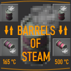

# Barrels of Steam
###### A Factorio mod

This mod adds steam barrels at 165 °C and 500 °C, as well as recipes for barreling and unbarreling.

This all stems from a weird plan a friend and I had in our game to build a nuclear reactor on a remote island that we never set foot on, using only drones to send fuel rods across the sea and carry back superheated steam in barrels. Yes, it's a little silly, but you can put any fluid in a tank but not every fluid in a *barrel*, and we had just kind of expected this feature to already be there, and it wasn't probably due to steam temperature being relevant. Anyway, our next game plan is to create a base powered only by barrels of hot steam - no solar, no big pylons, no pipes, no tanks, plus more.

## Recipes

### Steam Barrel

**Empty barrel** + 50× **Steam** (≥ 165 °C) ⇌ **Steam barrel** (165 °C)

Unlocked by **Fluid handling** technology.

### Superheated Steam Barrel

**Empty barrel** + 50× **Steam** (≥ 500 °C) ⇌ **Superheated steam barrel** (500 °C)

Unlocked by **Nuclear power** technology.

## Installation

Either download on [mods.factorio.com](https://mods.factorio.com/mod/barrels-of-steam)

Or copy `build/<factorio_version>/barrels-of-steam_x.x.x.zip` into `%appdata%/Factorio/mods/` and launch Factorio.
