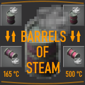
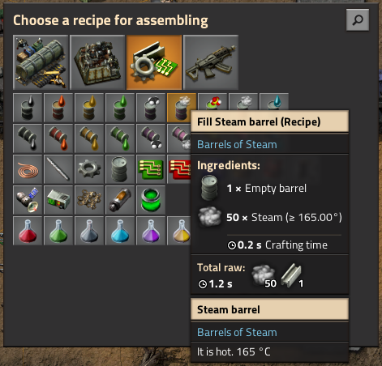
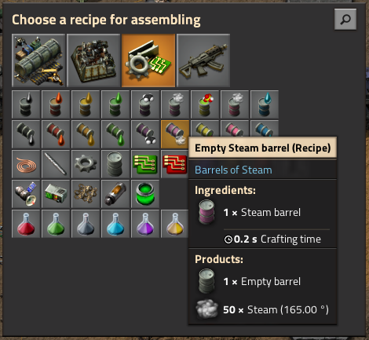
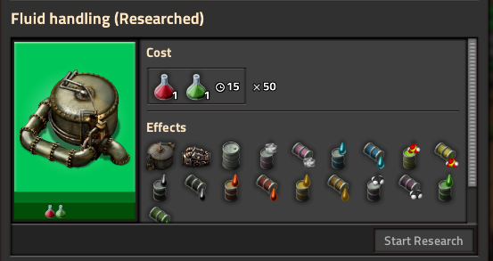
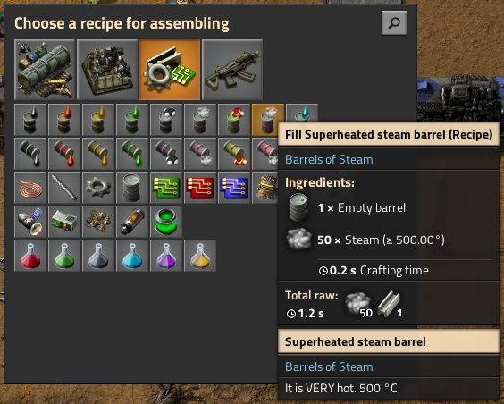
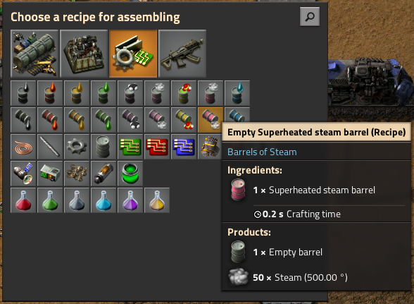
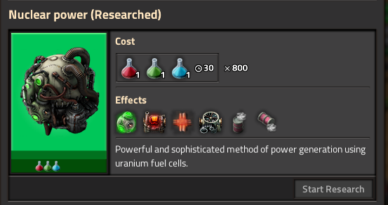

# Barrels of Steam
###### A Factorio mod

This mod adds steam barrels at 165 °C and 500 °C, as well as recipes for barreling an unbarreling.

## Recipes

### Steam Barrel

**Empty barrel** + 50× **Steam** (≥ 165 °C) ⇌ **Steam barrel** (165 °C)

Unlocked by **Fluid handling** technology.

### Superheated Steam Barrel

**Empty barrel** + 50× **Steam** (≥ 500 °C) ⇌ **Superheated steam barrel** (500 °C)

Unlocked by **Nuclear power** technology.

## Installation

Simply copy `build/barrels-of-steam_x.x.x.zip` into `%appdata%/Factorio/mods/` and launch Factorio.
